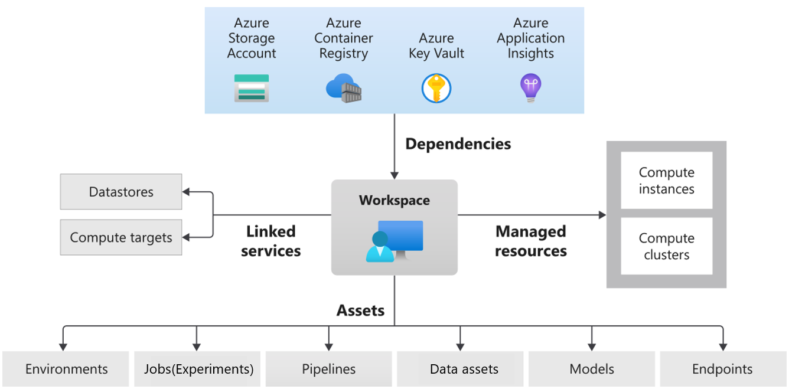

# Challenge 0: 前提条件

**[Home](./README.md)** - [Next Challenge >](./Challenge-01.md)

## Introduction

あなたは急ごしらえの糖尿病進行度予測プロジェクトに招集された Proseware 社のデータサイエンティストです。まだ発足したばかりなので、データサイエンティストは自分一人しかいません。しかし上層部の要求によりすぐに PoC を始めなければならず、残念ながらハイスペックなマシンを調達したり、AI プロジェクトに必要なツール類を制約の多い業務 PC に導入している時間がありません。ただし幸運なことにある程度の額の Azure サブスクリプションが提供されました。

## Rules
**チームメンバーは Hack セクションに記載されたタスクを行い、成功基準を満たす必要があります。タスクが完了した時点でコーチに成功基準を満たしていることを説明し、合格すれば次のチャレンジに進むことができます。**

**課題を解くためのヒントは学習リソース セクションの中に必ずあります。Hack がスタックしてしまったら学習リソースに立ち返ってください。**

## Description

DevOps と同様、MLOps は非常に幅広いトピックであり、使用するツールに関しても多くの選択肢があります。このチャレンジでは、コンピュータに適切なツールがインストールされていることを確認することに焦点を当てます。

本チャレンジでは、[Azure Machine Learning スタジオ](https://docs.microsoft.com/azure/machine-learning/overview-what-is-machine-learning-studio)と呼ばれるクラウドプラットフォーム上で開発を行います。

Azure Machine Learning ワークスペースと各アセットとリソースについて[解説](https://docs.microsoft.com/azure/machine-learning/concept-azure-machine-learning-v2?tabs=cli)を見ながら関係を理解します。

## 前提条件
- Azure のサブスクリプションを取得していること。お持ちでない場合は、[無料トライアル](https://azure.microsoft.com/free/)にお申し込みください。以下の Azure リソースを作成できることを確認します。以下のリソースは Azure Machine Learning リソースを作成すると自動的に作成されるため、基本的にユーザーが直接操作する必要はありません。
  - Azure Machine Learning
  - Application Insights
  - Azure Container Registry
  - Azure Container Instance
  - KeyVault
  - Storage Account
- Azure Machine Learning の外部サービス連携として、以下のリソースを使用します。リソースは Azure Machine Learning から自動的に作成されます。
  - Azure Logic Apps
  - Azure Event Grid
- CI/CD ツールとして、**Github Actions** をメインで使用します。事前に **Github アカウントをご用意ください**。
- すでに Visual Studio Code をお使いの方は [Visual Studio Code Azure Machine Learning 拡張機能](https://docs.microsoft.com/azure/machine-learning/how-to-setup-vs-code) をインストールすることで効率的にチャレンジを遂行できます。ローカル PC からリモートのコンピューティング インスタンスにアタッチすることで、ローカル環境を変更せずにコーディングが可能になり、さらに言語サポートやオートコンプリート機能が利用できます。
- 提供された無償の Azure Pass がある場合は、そのまま [Azure Portal](https://portal.azure.com/) にログインできます。認証時の多要素認証は本 Hack ではスキップできます。
- 本コンテンツは **Azure ML CLI v2** 向けに作成されています。
- **OpenHack 運営事務局向け事前確認手順解説は[こちら](./Solutions/Solution-Challenge-00-1.md)**

## Hack
以下の Azure Machine Learning アセットとリソースを作成します。Azure Machine Learning スタジオ UI から作成しても、CLI v2 や [VS Code](https://docs.microsoft.com/azure/machine-learning/how-to-set-up-vs-code-remote?tabs=extension) から作成してもかまいません。
1. [Azure Machine Learning ワークスペース](https://ms.portal.azure.com/)の作成。これは機械学習モデルの実験、学習、デプロイに使用する、クラウド上の基礎的なリソースです。
1. **コンピューティング インスタンス**の作成（汎用 Standard_D2_v2 推奨）
1. Azure Machine Learning スタジオのホームから **Notebooks** の「今すぐ開始」をクリックし、コーチが提供する Git リポジトリ `https://github.com/nohanaga/openhack-for-mlops-v2-students.git` をワークスペースにクローンします。
1. ノートブックのマイ ファイル ウィンドウで ↻ をクリックしてビューを更新し、新しい /Users/\<your-user-name\>/openhack-for-mlops-v2-students フォルダーが作成されていることを確認します。
1. Notebooks フォルダ内の `exercise00_1_login_azure.ipynb` を開き、作成した**コンピューティング インスタンス**を割り当て、カーネルを「Python 3.8 - AzureML」にセットしセルを上から実行して CLI コマンドで Azure にログインできることを確認し、Azure ML CLI v2 をインストールします。

    **注意:** ノートブック上部に *"いずれかの Azure SDK を使用するには、コンピューティングに対して認証される必要があります。認証されるには、認証ボタンを使用してください。"* と表示された場合は認証ボタンを押してアカウントの認証を行います。

    **Tips:** Jupyter Notebook や JupyterLab の UI を使用したい方は、**コンピューティング インスタンス**のリストから起動することができます。

1. Notebooks フォルダ内の `exercise00_2_prepare_data.ipynb` を開き、作成した**コンピューティング インスタンス**を割り当て、カーネルを「Python 3.8 - AzureML」にセットしセルを上から実行してデータをダウンロードしてデータ アセットとしてインポートします。

## 成功基準

- Azure Machine Learning ワークスペースが Azure サブスクリプションに作成されている。
- Azure Machine Learning ワークスペースにコンピューティング インスタンスが作成されている。
- CLI v2 で Azure Machine Learning ワークスペース情報が正常に取得できる。
- 学習に使うヘルスケアデータがデータ アセットに登録されている。

 

## ヒント
- [Azure Machine Learning の利用を開始するために必要なワークスペース リソースを作成する](https://docs.microsoft.com/azure/machine-learning/quickstart-create-resources)
- [ワークスペースで Jupyter Notebook を実行する](https://docs.microsoft.com/azure/machine-learning/how-to-run-jupyter-notebooks)
 - [Azure Machine Learning ワークスペースを作成して探索する](https://microsoftlearning.github.io/DP-100JA-Designing-and-Implementing-a-Data-Science-Solution-on-Azure/Instructions/01-create-a-workspace.html)
- [データ資産を作成する](https://docs.microsoft.com/azure/machine-learning/how-to-create-register-data-assets?tabs=CLI)
- [Visual Studio Code で Azure Machine Learning コンピューティング インスタンスに接続する](https://docs.microsoft.com/azure/machine-learning/how-to-set-up-vs-code-remote?tabs=extension)

## 学習リソース
- [Azure Machine Learning のしくみ: リソースとアセット (v2)](https://docs.microsoft.com/azure/machine-learning/concept-azure-machine-learning-v2?tabs=cli)
- [Azure Machine Learning ワークスペースとは](https://docs.microsoft.com/azure/machine-learning/concept-workspace)
- [Azure Machine Learning コンピューティング インスタンスとは](https://docs.microsoft.com/azure/machine-learning/concept-compute-instance)
- [Azure Machine Learning CLI と Python SDK v2 の概要](https://docs.microsoft.com/azure/machine-learning/concept-v2)
- [Visual Studio Code 拡張機能を使用して Azure Machine Learning リソースを管理する](https://docs.microsoft.com/azure/machine-learning/how-to-manage-resources-vscode)
